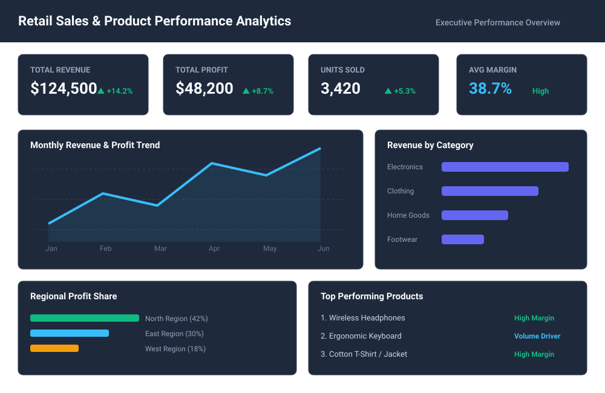

# Retail Sales & Product Performance Analytics

I built this project to analyze retail sales performance across product lines and store locations. The goal was to take raw sales records, process the data, and present key profit trends in an executive analytics dashboard format.

---

## 📊 Dashboard Preview



---

## Project Structure

* `sales_data.csv` - Raw order transaction records.
* `transform_data.py` - Python script for cleaning, margin calculations, and data processing.
* `gemini-svg.svg` - Interactive Power BI visual dashboard layout mockup.
* `README.md` - Comprehensive documentation and SQL business logic breakdown.

---

## 1. Basic Analysis

### Objectives
1. Calculate total order volume and aggregate sales revenue.
2. Identify top-selling items by total unit volume.
3. Determine average unit price across categories.

### Key SQL Queries & Logic
```sql
-- 1. Total Revenue Generated
SELECT SUM(units_sold * unit_price) AS total_revenue 
FROM sales_data;

-- 2. Top 5 Most Ordered Items
SELECT product_name, SUM(units_sold) AS total_quantity 
FROM sales_data 
GROUP BY product_name 
ORDER BY total_quantity DESC 
LIMIT 5;
